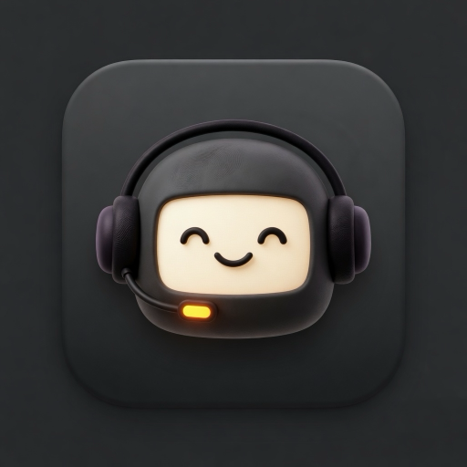
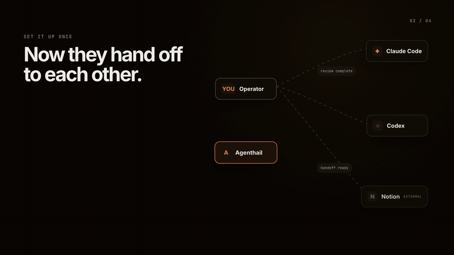

# agenthail

<p align="center">
  
</p>

**Your agents are already working. Agenthail helps them work together.**

[](https://github.com/zm2231/agenthail/actions/workflows/ci.yml)  

Agenthail connects the Claude Code, Codex, and Notion conversations you already use. It gives them one shared place to pass work, keep going, and stay reachable when you leave your desk.



## The problem

Your work is split across agents that cannot see each other.

Claude Code is investigating in one window. Codex is building in another. A Notion thread holds the research. Each one knows its own assignment, but none of them knows what happened next door.

You become the connection layer. You read one answer, decide who needs it, switch windows, paste it over, and remember which agent is still working. When you step away, that coordination stops.

Agenthail connects those pieces. It gives you one view of what is running, a way to reach every conversation, and handoffs that keep moving without you copying messages around.

## Install

Agenthail supports Apple silicon Macs. Download the latest `Agenthail-*-arm64.pkg` from [GitHub Releases](https://github.com/zm2231/agenthail/releases), open it, then run:

```bash
agenthail doctor
```

The package installs the Mac app, menu bar item, and command line tool. Agenthail opens automatically and stays ready in the background.

Homebrew is also available:

```bash
brew install zm2231/tap/agenthail
brew services start agenthail
```

To update:

```bash
agenthail update --check
agenthail update
```

To remove a package installation, run `sudo agenthail-uninstall`. Your local conversations, queue, and history are preserved unless you add `--purge-data`.

Developing Agenthail itself? See the [maintainer documentation](docs/maintainers/).

## Connect your apps

Each app connects independently. If you do not use Notion, it simply stays out of the way. If one app needs attention, the others keep working.

### Claude Code

In Claude Code, run `/config` and turn on **Remote Control for all sessions**. You can enable a single conversation with `/rc` instead.

Agenthail then finds the Claude Code conversations that are still open on your Mac.

### Codex

Start a writable Codex terminal conversation from any project folder:

```bash
agenthail codex
```

For Codex Desktop, quit it once and open it through Agenthail:

```bash
agenthail launch codex
```

Agenthail can still show older Codex history, but it only offers a message box when it knows the conversation is connected and writable.

### Notion

Notion is optional. It works as an external workspace for research, notes, and longer-running threads. If you are already signed into Notion in Chrome, Agenthail can find those threads and start new ones.

## One place to check in

The Mac app shows what is working now, what is waiting, and what needs you. Open a conversation to read the transcript, send the next instruction, steer the current turn, stop it, compact it, or change models when that conversation supports it.

The same actions are available from the command line:

```bash
agenthail list
agenthail send @writer "draft the explanation" --reply
agenthail steer @builder "keep the example, cut the setup"
agenthail queue @reviewer "check the final implementation"
agenthail history @writer 25
```

When an agent is already working, Agenthail holds the next message until it is ready. Use `steer` when you want to change the turn that is running now.

## Let agents hand work to each other

Give useful conversations short names:

```bash
agenthail identify claude:test-session investigator
agenthail identify codex:test-session-23 builder
```

Then connect them:

```bash
agenthail relay add @investigator @builder 'FAIL|NO-SHIP|root cause'
```

When the investigation finishes with something the builder needs, Agenthail passes it across. If the builder is busy, the handoff waits. You can see every handoff and cancel anything that should not go out.

For a group that needs the same update:

```bash
agenthail channel create launch
agenthail channel add launch @writer
agenthail channel add launch @builder
agenthail channel send launch "The release date moved to Friday" --from zain
```

## Start work without opening another window

An agent or script can start a new Codex thread directly:

```bash
agenthail thread create codex "Implement the verified fix" --alias builder --json
```

The thread starts in your current folder unless you choose another project with `--cwd`.

Notion threads can start the same way:

```bash
agenthail send notion:new:launch-notes "Draft the launch notes" --reply
```

## Stay connected from your phone

Install Tailscale on your Mac and iPhone, sign both into the same account, then open **Operations** in Agenthail on the Mac.

Turn on **Private phone access** and choose **Pair an iPhone**. The iPhone app can then show current work, open conversations, send or steer messages, and notify you when an agent finishes. Your Mac is not opened to the public internet.

## What Agenthail remembers

Agenthail keeps a local record of messages it moved, work still waiting, retries, failures, and automatic handoffs. The Audit view makes it possible to come back hours later and understand what happened.

```bash
agenthail queue list
agenthail queue retry 12
agenthail queue rm 12
agenthail history --json
```

Your full transcripts remain in the apps that created them. Agenthail keeps only the local information it needs to coordinate delivery and show the audit trail.

## Privacy

There is no Agenthail account and no telemetry.

Your conversations and history stay on your Mac. Phone access is private to your Tailscale network. If you enable iPhone notifications, Agenthail sends only a generic completion or failure alert through Apple. It never puts reply text or browser sign-in data in a notification.

Read the full [security and privacy model](SECURITY.md).

## Help and deeper documentation

- `agenthail doctor` checks every connected app and tells you what needs attention.
- [Native Mac and iPhone apps](docs/native-apps.md)
- [Security and privacy](SECURITY.md)
- [Maintainer documentation](docs/maintainers/)

## License

Source-available under the [PolyForm Noncommercial License 1.0.0](LICENSE). Personal, research, educational, nonprofit, and other noncommercial use are permitted under its terms. Commercial use needs a separate license: see [COMMERCIAL.md](COMMERCIAL.md) or contact [zainmer@protonmail.com](mailto:zainmer@protonmail.com).
