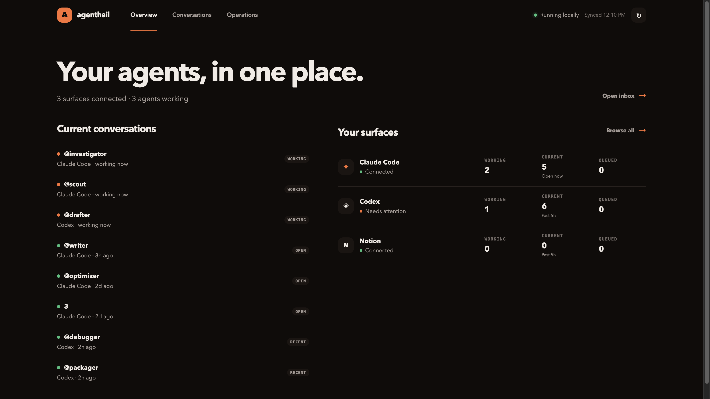

# agenthail

**Your agents are already working. agenthail keeps everyone connected.**

[](https://github.com/zm2231/agenthail/actions/workflows/ci.yml)    

agenthail connects the AI agents already working across your devices and apps, both to each other and back to you.



```bash
agenthail send @investigator "find the root cause" --reply
agenthail relay add @investigator @builder
```

## The problem

Your work is spread across running agents, and there is no unified way to reach them, watch them, or help them work together.

Claude Code is mid-investigation in one window. Codex is waiting for instructions in another. Each session understands its own assignment perfectly well and knows nothing about what happened next door. Everything connecting them is you: reading one answer, deciding who needs it, switching windows, pasting, and trying to remember which session is still mid-turn so you don't interrupt it.

Then you walk away from the desk and the whole thing stops, because you were the part that moved work between them.

## Connect the agents to each other

There is no setup step. agenthail finds the sessions that are already running, and you can reach one, queue work for it, steer it mid-turn, or wire its finished answers straight into another agent.

```bash
agenthail list

agenthail send codex:test-session-23 "implement the fix" --reply
agenthail relay add claude:test-session codex:test-session-23
agenthail daemon install
```

That relay is the idea in one line. Every completed answer from the Claude Code session now arrives in Codex, in order, without you. If Codex is mid-turn, it waits. If the daemon restarts, it picks up where it left off.

You can target a session by `surface:target`, its PID, a session-ID prefix, or a fragment of its working directory. Aliases are optional sugar, for when you are tired of typing a session ID:

```bash
agenthail identify claude:test-session investigator
agenthail identify codex:test-session-23 builder

agenthail send @investigator "find the root cause" --reply
agenthail relay add @investigator @builder 'FAIL|NO-SHIP|root cause'
```

That last relay only hands work across when the investigation actually says something worth acting on.

Nothing about your setup changes. No tmux, no wrappers, no rebuilding your agents inside somebody's framework. You keep using Claude Code and Codex exactly the way you already do, and agenthail attaches to the sessions that are already running, with their context and permissions and open files intact.

## Connect the agents back to you

The other half is you being able to reach them, especially when you are not at the keyboard.

```bash
agenthail dashboard enable
```

The dashboard is one live view of every agent and its status. Check in, steer a turn, queue what comes next, or pass one agent's result to another. It binds to `127.0.0.1:7412` behind a per-install access token, and nothing listens until you enable it.

Then walk away. The daemon keeps the handoffs moving and holds the next instructions for whichever agent is still busy. The dashboard stays available for checking progress and steering work.

To pick it up from your phone, install Tailscale on the Mac and the phone, sign both into the same tailnet, then:

```bash
agenthail dashboard remote
```

That configures a tailnet-only Tailscale Serve route and prints an authenticated link and QR code. agenthail stays bound to loopback; Funnel and public internet exposure are never enabled. The link and the QR contain the dashboard token, so treat them as private. Rotating the token revokes saved access.

```bash
agenthail dashboard remote status
agenthail dashboard remote off
```

## See everything that happened

Every message agenthail moves is written to a local audit trail, so you can come back to a machine that has been running agents for six hours and reconstruct what actually went where.

The dashboard keeps it under Operations → Audit, with a search box, an event-type filter, and older activity paged in on demand. The same record is on the CLI:

```bash
agenthail history
agenthail history @writer 25
agenthail history --json
```

Each event says what happened, not just that something did. A message is `queued`, then `sent` or `delivered`; a target that was mid-turn is `busy`; a relay that fired is `relay`, and one that was filtered out or hit the hop limit is `relay-dropped`. Failures are `failed`, retries are `retry`, and a delivery whose outcome could not be confirmed is `unknown`. Withdrawn instructions are `canceled`, so a message you pulled back leaves a trace instead of vanishing.

The queue is inspectable the same way, including work that failed and is waiting on you:

```bash
agenthail queue list
agenthail queue list --all --json
agenthail queue retry 12
agenthail queue rm 12
agenthail queue clear @writer
```

Nothing here leaves your machine. The trail is bounded on purpose (the newest 2000 events, each field capped at 16 KiB and marked `[truncated]` past that), so it records what the daemon decided without turning into a second copy of every transcript. Writing history is treated as observability, never as delivery, so a problem recording an event cannot fail a message that actually went out.

## Install

macOS on Apple silicon, for now. Install Agenthail with Homebrew:

```bash
brew install zm2231/tap/agenthail
brew services start agenthail
agenthail doctor
```

Homebrew installs the signed and notarized binary plus its local sidecars, puts `agenthail` on your PATH, and keeps the daemon running across logins. Upgrade later with `brew upgrade agenthail`.

To install from source instead, you need Go, Node.js, Python 3.10 or newer, and Chrome:

```bash
git clone https://github.com/zm2231/agenthail.git
cd agenthail
./install.sh
```

The source installer puts the binary and sidecar under `~/.local/share/agenthail`, then drops the `agenthail` wrapper in the first writable standard command directory (`/opt/homebrew/bin`, `/usr/local/bin`, or `~/.local/bin`). Running it again upgrades in place and restarts the daemon on the new binary.

If you already run Claude Code or Codex, it also links the agenthail operations skill into `~/.claude/skills` and `~/.codex/skills`, so your agents know how to drive the CLI themselves. It never creates those directories, so nothing shows up on a machine that does not use them. Skip it with `./install.sh --no-skill`.

For queues and relays that survive logouts and reboots:

```bash
agenthail daemon install
agenthail daemon status
```

That installs a launchd service with restart-on-crash. To run it only when you want it, use `agenthail daemon start` and `agenthail daemon stop`.

## Surfaces

A surface is somewhere your agents already live. Claude Code and Codex are the two that carry the work. Notion is optional, and it is there because a research thread is sometimes the thing you want to hand to a builder.

They are independent, so one being unavailable never blocks the others.

| | Claude Code | Codex | Notion |
|---|---:|---:|---:|
| Find existing sessions | yes | yes | yes |
| Send and read replies | yes | yes | yes |
| Stream a turn | yes | yes | |
| Steer / interrupt | yes | yes | |
| Compact | yes | yes | |
| Session model switch | yes | yes | |
| Per-message model | | yes | yes |
| Goal tracking | | yes | |

Claude Code model switching goes through the session's `/model` command. agenthail waits for the local confirmation, so an unknown model returns an error instead of looking like it worked.

### Codex: which sessions agenthail can write to

Codex is not one thing. agenthail can *read* every Codex session and its history, but whether it can *send* depends on how that session was started.

| How the session started | Read | Send |
|---|:---:|:---:|
| `agenthail codex` (terminal) | yes | yes |
| Codex Desktop, launched with `agenthail launch codex` | yes | yes |
| Codex Desktop, opened normally | yes | no |
| `codex` (plain terminal) | yes | no |

**Terminal.** Start Codex through agenthail and the session is fully writable:

```bash
agenthail codex
agenthail codex --model gpt-5.6-sol
```

That runs Codex on agenthail's local app-server. It does not replace the `codex` command and does not change your shell. Sessions you started with plain `codex` stay readable, and agenthail can see their history, but it cannot send into them: a standard terminal process gives it no safe external input path. This is being fixed.

**Desktop.** Codex Desktop is writable, but only when it is running agenthail's local bridge, which means it has to be launched through agenthail at least once:

```bash
agenthail launch codex
```

Open Codex Desktop straight from the Dock and agenthail can still read it, but has nothing to send through. `agenthail doctor` tells you which state you are in.

## Finding your sessions

```bash
agenthail list
agenthail list --all --json
```

In scripts, qualify the surface so there is no guessing:

```text
claude:test-session
codex:test-session-23
notion:3978aba0-0606-80ac-a1ae-00a9eb229fc0
```

For daily use, aliases are nicer. Ambiguous names fail and print the candidates; agenthail asks you to qualify rather than picking a session at random.

## The commands I actually use

```bash
# Send and wait for the completed reply
agenthail send @writer "draft the explanation" --reply
agenthail send @writer "produce the full report" --reply --timeout 5m

# Watch a turn as it arrives
agenthail send @writer "walk through the issue" --stream

# Read without sending
agenthail reply @writer
agenthail last @writer 5 --full

# Busy agent: leave the next instruction for when it goes idle
agenthail queue @writer "after that, tighten the intro"

# Busy agent: change the turn that is running right now
agenthail steer @writer "keep the example, cut the setup"

# See what is waiting, failed, or already went out
agenthail queue list
agenthail queue retry 12
agenthail history @writer 25

# Stop or compact a session
agenthail interrupt @writer
agenthail compact @writer
```

Long prompts can come from stdin:

```bash
agenthail send @writer - < prompt.txt
```

When `send` hits an active agent it queues the message and tells you when `steer` would have been the better call. Use `--no-queue` when the caller needs immediate delivery or nothing; if the target is active it fails instead of creating a queue row.

## Channels

When two or three sessions need the same context:

```bash
agenthail channel create launch
agenthail channel add launch @writer
agenthail channel add launch @builder
agenthail channel send launch "new requirement: keep the old API working" --from zain
```

Every member gets a result. Busy members go to the queue. A partial failure exits nonzero so a script can catch it.

## Notion threads

Notion works with existing threads, including a known thread UUID that has fallen outside the 50 most recent results, and can create a persistent one:

```bash
agenthail send notion:new "Start a research thread" --reply
agenthail send notion:new:launch-notes "Draft the launch notes" --reply
```

The receipt returns the persisted thread UUID, which agenthail registers for replies and follow-ups. In `new:launch-notes`, the name becomes a durable local alias; Notion still generates the visible title from the first message.

## What makes the handoffs trustworthy

None of the above is worth much if a handoff can silently drop, duplicate, or loop. So:

Queues preserve the full message and its model choice, and delivery stays ordered per session. A busy or rejected delivery stays queued. Known pre-dispatch failures retry with a bounded backoff, and repeated failures become visible dead letters instead of disappearing.

If the daemon dies in the window where a message may have reached the agent but was not acknowledged locally, agenthail marks the outcome **unknown** rather than sending the instruction a second time. You decide whether to retry. Quietly double-sending an instruction to a coding agent is worse than stopping and asking.

Relay routes are validated as a graph when you create them, so a self-route or a cycle like `@a → @b → @a` is rejected before it can exist. Relay payloads are truncated before they enter the next agent's context. Each route remembers which completed turn it already delivered, across restarts, so old answers stay old.

Replies are bound to a new completed turn, which is why `--reply` cannot hand you the last thing the agent happened to say before you asked. Streams are bound to the session and turn that started them, so a Codex event from another thread cannot leak into your output.

## Security

agenthail reads browser cookies and runs a local HTTP server, so it is worth being specific. [SECURITY.md](SECURITY.md) has the full threat model.

Short version: everything stays on your machine. Nothing listens until you run `agenthail dashboard enable`, and when you do, it binds to loopback behind a per-install token and rejects cross-origin actions. The sidecar reads fresh Chrome cookies without printing them, and if the cookie bridge fails the request stops there instead of falling back to something weaker. There is no agenthail server, no telemetry, and no account.

## Surface setup

Claude Code and Notion use the Chrome profile you are already signed into. The default is `Default`:

```bash
AGENTHAIL_CHROME_PROFILE="Profile 2" agenthail doctor
```

Codex needs a local bridge into the Desktop app. Launch it once through agenthail:

```bash
agenthail launch codex
```

Fresh launches expose only Chromium's renderer debugger on loopback. agenthail then asks the renderer to use Desktop's own app-server connection, so messages and turns stay visible in the app you are already looking at. It does not write to the app-server child process, and it does not launch Codex with Node's crash-prone `--inspect` flag.

Agenthail's background service also keeps the Codex read connection available after login and restarts it if it disappears. `agenthail doctor` reports whether that connection is reachable and supervised.

The bridge uses port `9231` by default:

```bash
AGENTHAIL_CODEX_REMOTE=9331 agenthail launch codex
```

The rest of the environment variables are escape hatches:

| Variable | Use |
|---|---|
| `AGENTHAIL_CHROME_PROFILE` | Chrome profile for Claude Code / Notion cookies |
| `AGENTHAIL_PYTHON` | Absolute Python 3.10+ interpreter for the sidecar |
| `AGENTHAIL_CODEX_BIN` | Codex executable to use when it is outside `PATH` |
| `AGENTHAIL_CODEX_REMOTE` | Loopback Codex renderer-debugging port, default `9231` |
| `AGENTHAIL_NOTION_SPACE` | Pin a Notion space when auto-detection is ambiguous |
| `AGENTHAIL_NOTION_USER` | Pin a Notion user when auto-detection is ambiguous |
| `AGENTHAIL_MAX_RESPONSE_BYTES` | Sidecar response limit, default 16 MiB |
| `AGENTHAIL_DEBUG=1` | Sidecar diagnostics, without cookie values |

## Build and verify from source

```bash
go test ./... -race -count=1
go vet ./...
scripts/test-install-upgrade.sh
scripts/package-release.sh
bash -n install.sh
python3 -m py_compile sidecar/sidecar.py
```

Runtime state lives in `~/.agenthail` (`registry.db`, daemon lock/PID/log). `doctor`, `list`, `send`, `history`, and the queue commands all take `--json` and return stable documents, so you can script around them. Delivery history is bounded and local: it records what the daemon decided, without copying whole transcripts.

Release archives from `scripts/package-release.sh` carry the binary, sidecar, installer, and skills, so extraction does not require Go. The packager requires a clean worktree, embeds the exact revision and build time, signs the macOS binary with a Developer ID identity, submits it for notarization, and emits a SHA-256 checksum. A production build fails closed when signing or notarization is unavailable.

## Where this breaks

Claude Code, Codex, and Notion all expose integration surfaces that can change underneath agenthail, and sometimes they do. `agenthail doctor` is the first thing I run after any of those apps updates.

Then I try the real thing, because the only test that counts is whether one agent can still reach the next one.

## License

Source-available under the [PolyForm Noncommercial License 1.0.0](LICENSE), which is not an OSI-approved open-source license. Personal, research, educational, nonprofit, and other noncommercial use are permitted under its terms. Commercial use needs a separate license: see [COMMERCIAL.md](COMMERCIAL.md) or contact [zainmer@protonmail.com](mailto:zainmer@protonmail.com).
