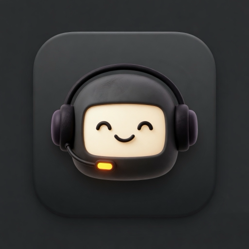
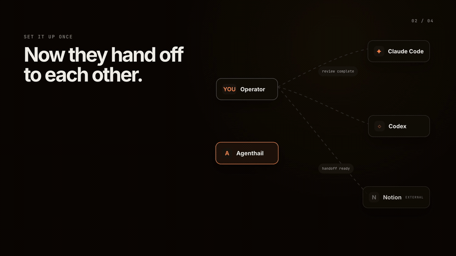

# agenthail

<p align="center">
  
</p>

**Your agents are already working. Agenthail helps them work together.**

[](https://github.com/zm2231/agenthail/actions/workflows/ci.yml)  

Agenthail connects the Claude Code, Codex, and Notion conversations you already use. It gives them one shared place to pass work, keep going, and stay reachable when you leave your desk.



## The problem

Your work is split across agents that cannot see each other.

Claude Code is investigating in one window. Codex is building in another. A Notion thread holds the research. Each one knows its own assignment, but none of them knows what happened next door.

You become the connection layer. You read one answer, decide who needs it, switch windows, paste it over, and remember which agent is still working. When you step away, that coordination stops.

Agenthail connects those pieces. It gives you one view of what is running, a way to reach every conversation, and handoffs that keep moving without you copying messages around.

## Install

Agenthail supports Apple silicon Macs. Download the latest `Agenthail-*-arm64.pkg` from [GitHub Releases](https://github.com/zm2231/agenthail/releases), open it, then run:

```bash
agenthail doctor
```

The package installs the Mac app, menu bar item, and command line tool. Agenthail opens automatically and stays ready in the background.

Homebrew is also available:

```bash
brew install zm2231/tap/agenthail
brew services start agenthail
```

To update:

```bash
agenthail update --check
agenthail update
```

To remove a package installation, run `sudo agenthail-uninstall`. Your local conversations, queue, and history are preserved unless you add `--purge-data`.

Developing Agenthail itself? See the [maintainer documentation](docs/maintainers/).

## Connect your apps

Each app connects independently. If you do not use Notion, it simply stays out of the way. If one app needs attention, the others keep working.

### Claude Code

Agenthail discovers open Claude Code sessions through their local messaging sockets. Native messages require the Agenthail daemon and do not need browser cookies or Remote Control. Sessions that expose only a Remote Control bridge use that transport; enable it with `/rc` in Claude when needed.

The daemon automatically registers the current/recent page of Codex and Notion agents as individual Claude peers, refreshing discovery every 30 seconds. They appear in Claude's `ListAgents` as `agenthail/<surface>: <name>`. Claude can reply to them using native `SendMessage`; Agenthail puts those messages in its durable queue. Read-only agents are discoverable, but inbound messages to them are denied and recorded in history.

An older agent registers automatically when it sends to Claude. Use `--from @alias` or `--from surface:session-id` to identify it. Agenthail also recognizes `AGENTHAIL_SESSION_ID`, `CODEX_THREAD_ID`, and `CLAUDE_SESSION_ID`, in that order. Without a sender identity, messages use an operator peer whose replies are kept in history.

```bash
agenthail send claude:<session-id> "Here are the findings" --from @builder --json
agenthail history @builder 25
```

A socket acknowledgement means transport acceptance, not model completion. Claude's inbound policy can still hold or deny the message. Agenthail does not invent a permission-mode attestation. Native sends do not support `--reply`, `--stream`, or slash commands; read the transcript with `last` or receive a native `SendMessage` reply. Compact, model, interrupt, and steer are typed controls. They require the target session to advertise a separate Remote Control identity and are never placed in the ordinary message queue.

### Codex

Start a writable Codex terminal conversation from any project folder:

```bash
agenthail codex
```

This is the only managed terminal creation path. It uses Codex remote control and remains separate from Codex Desktop's writer.

For Codex Desktop, start it with `agenthail launch codex`. Agenthail then uses a loopback-only Desktop bridge to communicate with the app-server that already owns your conversations. Desktop conversations load through that owner before a message is sent; Agenthail does not acquire them through its managed runtime. If Codex is already open, quit it and run that command before using Desktop message controls. Agenthail never restarts Codex while conversations are attached.

If a prior managed terminal leaves a writer lease after it exits, Agenthail reports an ownership conflict instead of retrying indefinitely. After confirming no managed `agenthail codex` terminal is active, run `agenthail codex --repair-managed-runtime`, then retry the Desktop conversation. That command restarts only the managed remote-control runtime; it does not restart Codex Desktop.

### Notion

Notion is optional. It works as an external workspace for research, notes, and longer-running threads. If you are already signed into Notion in Chrome, Agenthail can find those threads and start new ones.

## One place to check in

The Mac app shows what is working now, what is waiting, and what needs you. Open a conversation to read the transcript, send the next instruction, steer the current turn, stop it, compact it, or change models when that conversation supports it.

The same actions are available from the command line:

```bash
agenthail list
agenthail send @writer "draft the explanation" --reply
agenthail steer @builder "keep the example, cut the setup"
agenthail queue @reviewer "check the final implementation"
agenthail history @writer 25
agenthail search codex "quarterly planning"
```

When an agent is already working, Agenthail holds the next message until it is ready. Use `steer` when you want to change the turn that is running now.
If Agenthail cannot reach a Codex session before starting a turn, it keeps that message pending and retries safely. A timeout after a turn has started is kept as an explicit unknown outcome instead, so Agenthail never guesses whether to send duplicate work. Messages that still cannot move after one hour expire instead of building up forever. They remain visible in the audit trail.

Agenthail keeps current work fast by using Codex's bounded local state. To find an older Codex conversation, use the dashboard search box or `agenthail search codex <query>`; selected results are saved locally for later use.

## Let agents hand work to each other

Give useful conversations short names:

```bash
agenthail identify claude:test-session investigator
agenthail identify codex:test-session-23 builder
```

Naming the same conversation again replaces its previous name.

Then connect them:

```bash
agenthail relay add @investigator @builder 'FAIL|NO-SHIP|root cause'
agenthail relay add @investigator @builder 'READY' --once
```

When the investigation finishes with something the builder needs, Agenthail passes it across. If the builder is busy, the handoff waits. You can see every handoff and cancel anything that should not go out. Closed Claude Code sessions stop receiving handoffs, rebind if the same conversation resumes, and remove the rule after one hour without a resume.

For a group that needs the same update:

```bash
agenthail channel create launch
agenthail channel add launch @writer
agenthail channel add launch @builder
agenthail channel send launch "The release date moved to Friday"
```

## Start work without opening another window

An agent or script can start a Codex thread or Claude background session directly:

```bash
agenthail thread create codex "Implement the verified fix" --alias builder --json
agenthail thread create claude "Investigate the build failure" --alias investigator --json
```

The session starts in your current folder unless you choose another project with `--cwd`. Claude background sessions support status, logs, stop and resume. Codex supports forks, its native input queue, reasoning effort, plan mode, service tier and structured output. These controls are available in the CLI and web dashboard; see [session operations](docs/maintainers/session-operations.md) for commands and retry behavior.

Notion threads can start the same way:

```bash
agenthail send notion:new:launch-notes "Draft the launch notes" --reply
```

## Stay connected from your phone

The iPhone companion is distributed through TestFlight. [Request an iPhone invite privately](mailto:zainmer@protonmail.com?subject=Agenthail%20iPhone%20TestFlight%20access&body=Please%20invite%20this%20Apple%20Account%20email%3A%20). Publishing the `.ipa` as a normal download would not make it installable on an ordinary iPhone, so TestFlight is the supported path while the app is in beta.

After installing the iPhone app, install Tailscale on your Mac and iPhone, sign both into the same account, then open **Operations** in Agenthail on the Mac.

Turn on **Private phone access** and choose **Pair an iPhone**. The iPhone app can then show current work, open conversations, send or steer messages, and notify you when an agent finishes. Your Mac is not opened to the public internet.

Matching voice-enabled builds also offer **Talk to orchestrator**: a real Codex
Voice conversation that can inspect agents, delegate work, and read replies through
one persistent operator. [Voice setup, flow, and current limits](docs/maintainers/codex-voice.md).

## What Agenthail remembers

Agenthail keeps a local record of messages it moved, work still waiting, retries, failures, and automatic handoffs. The Audit view makes it possible to come back hours later and understand what happened.

```bash
agenthail queue list
agenthail queue list --mine
agenthail queue list --cwd /Volumes/4/GitHub/agenthail
agenthail queue retry 12
agenthail queue rm 12
agenthail history --json
```

Your full transcripts remain in the apps that created them. Agenthail keeps only the local information it needs to coordinate delivery and show the audit trail.

## Privacy

There is no Agenthail account and no telemetry.

Your conversations and history stay on your Mac. Phone access is private to your Tailscale network. If you enable iPhone notifications, Agenthail sends only the connected app name and a completion or failure status through Apple. It never puts an agent name, conversation title, reply text, or browser sign-in data in a notification.

Read the full [security and privacy model](SECURITY.md).

## Help and deeper documentation

- `agenthail doctor` checks connection and current-session discovery. Each delivery also checks that the target can accept input immediately before a turn starts.
- [Native Mac and iPhone apps](docs/native-apps.md)
- [Security and privacy](SECURITY.md)
- [Maintainer documentation](docs/maintainers/)

## License

Source-available under the [PolyForm Noncommercial License 1.0.0](LICENSE). Personal, research, educational, nonprofit, and other noncommercial use are permitted under its terms. Commercial use needs a separate license: see [COMMERCIAL.md](COMMERCIAL.md) or contact [zainmer@protonmail.com](mailto:zainmer@protonmail.com).
